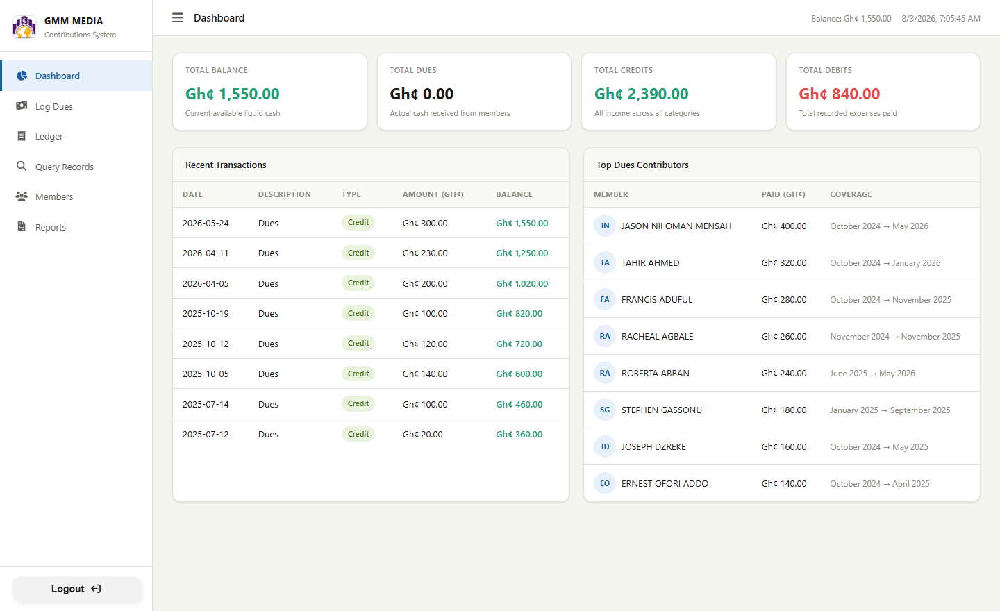
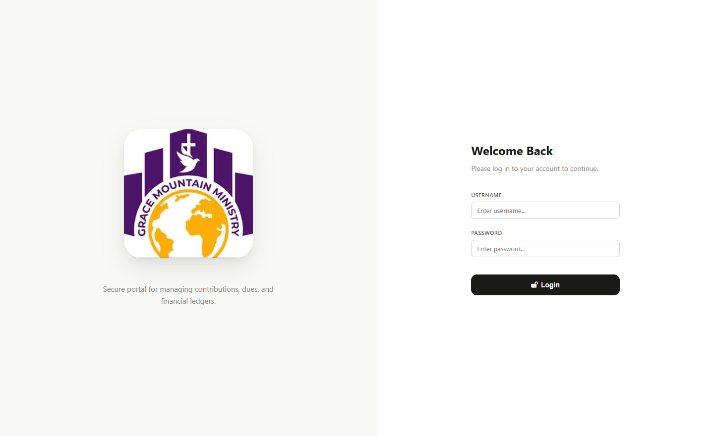
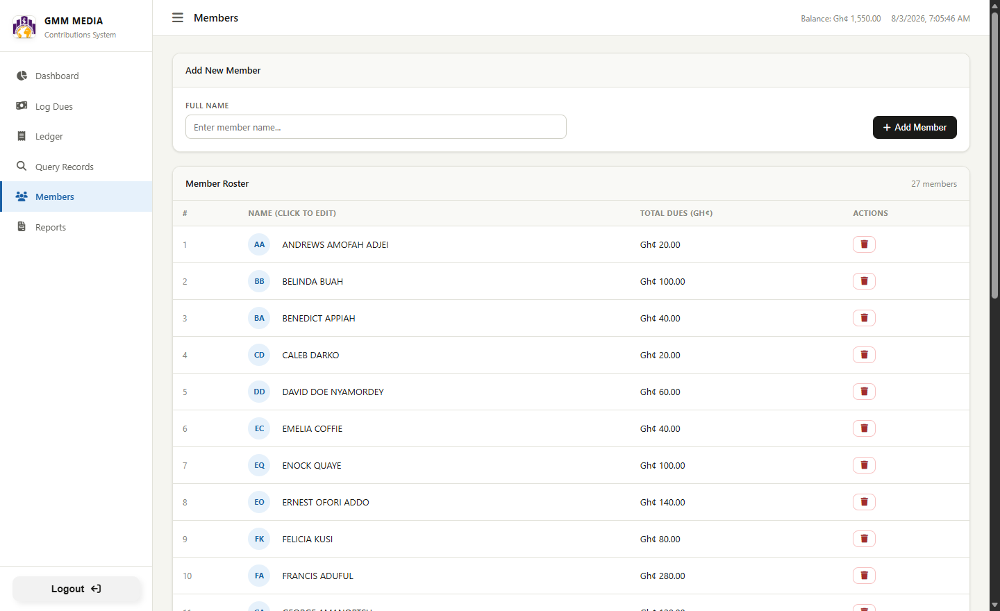
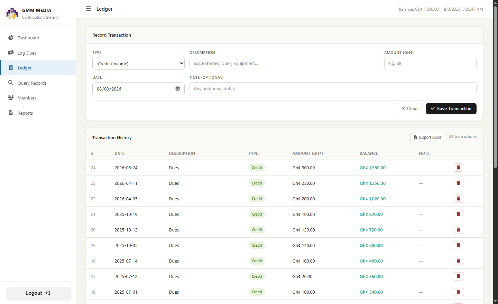

# Contribution Ledger

[](LICENSE)
[](https://www.python.org/downloads/)
[](https://flask.palletsprojects.com/)
[](tests/)

A lightweight, offline-first contribution and financial ledger for small
organizations — clubs, church groups, associations — that need to track
member dues and general income/expenses without standing up a database
server or paying for hosting. Runs entirely on a local SQLite file; a
single admin logs in to record transactions, everyone else can view them.

<p align="center">
  
</p>

## Table of Contents

- [Features](#features)
- [Screenshots](#screenshots)
- [Tech Stack](#tech-stack)
- [Quick Start](#quick-start)
- [Configuration](#configuration)
- [Usage](#usage)
- [Project Structure](#project-structure)
- [Data Model](#data-model)
- [API Reference](#api-reference)
- [Testing](#testing)
- [Migrations](#migrations)
- [Security Notes](#security-notes)
- [Deployment Notes](#deployment-notes)
- [License](#license)

## Features

- **Member management** — add, rename, and remove members
- **Dues tracking** — log a member's payment against a coverage period
  (e.g. "October 2024 → May 2025"); adjacent periods merge automatically
  so a member's history stays as a clean set of contiguous ranges
- **General ledger** — record any credit or debit (dues, equipment,
  offerings, etc.) with running-balance calculation
- **Dashboard** — at-a-glance balance, total dues, credits, debits, recent
  transactions, and top contributors
- **Search & filter** — query dues and ledger records by member, keyword,
  date range, or type; print or export results to CSV
- **Reports** — monthly or all-time financial reports, printable
- **Single-admin auth** — session-based login gated behind one password;
  reading data doesn't require login, writing does
- **Local SQLite database** — no external database server, auto-created
  on first run
- **Offline-first** — designed to run on a single machine on a local
  network, no internet dependency

## Screenshots

| Login | Dashboard |
|---|---|
|  |  |

| Members | Ledger |
|---|---|
|  |  |

## Tech Stack

- **Backend:** Python, [Flask](https://flask.palletsprojects.com/)
- **Database:** SQLite (via the standard library `sqlite3` module)
- **Frontend:** vanilla HTML, CSS, and JavaScript — no build step, no
  framework, no `npm install`. This is a deliberate choice: the app is
  meant to be cloned and run with nothing more than Python, matching its
  offline/zero-infrastructure goal.
- **Testing:** [pytest](https://pytest.org/)

## Quick Start

### Prerequisites

- Python 3.9 or later
- pip

### 1. Clone the repository

```bash
git clone https://github.com/niiomar/LEDGER.git
cd LEDGER
```

### 2. Configure environment variables

```bash
cp .env.example .env
```

Then edit `.env` and set a real `SECRET_KEY` and `ADMIN_PASSWORD` (see
[Configuration](#configuration) — **do not run this in production with
the example defaults**).

### 3. Install dependencies and run

**Windows:** double-click `run_windows.bat`, or from a terminal:

```powershell
.\run_windows.bat
```

**macOS / Linux:**

```bash
./run_mac_linux.sh
```

Either script creates a virtual environment on first run, installs
`requirements.txt`, and starts the server. Or do it manually:

```bash
python -m venv venv
source venv/bin/activate        # venv\Scripts\activate on Windows
pip install -r requirements.txt
python app.py
```

Then open **http://127.0.0.1:5000**. Anyone on the same machine or local
network can view data; log in with `admin` and your `ADMIN_PASSWORD` to
add, edit, or delete records.

## Configuration

All configuration lives in `.env` (see `.env.example`), loaded via
`python-dotenv`:

| Variable | Description | Default |
|---|---|---|
| `SECRET_KEY` | Signs Flask's session cookie. **Must** be a long random string in any real deployment — anyone with this value can forge a valid session. | `dev-only-change-me` |
| `ADMIN_PASSWORD` | Password for the single `admin` account. | `admin` |
| `DB_PATH` | Path to the SQLite database file. Created automatically if it doesn't exist. | `gmm_media.db` |

Generate a strong `SECRET_KEY` with:

```bash
python -c "import secrets; print(secrets.token_hex(32))"
```

The app prints a warning on startup if `SECRET_KEY` or `ADMIN_PASSWORD`
are still at their insecure defaults.

## Usage

1. **Log in** with `admin` and your configured password.
2. **Log Dues** — record a member's payment against a period; the amount
   auto-calculates from the selected period at a fixed monthly rate, and
   the system prevents gaps by locking the start period to right after
   their last paid month.
3. **Ledger** — record any other credit or debit (batteries, offerings,
   equipment, etc.). Every dues payment also lands here automatically as
   a linked credit, so the ledger is always the single source of truth
   for cash totals.
4. **Query Records** — filter dues/ledger by member, keyword, date range,
   or type; print the results or export them to CSV.
5. **Members** — add members, click a name to rename it inline, or
   remove a member (this also removes their dues and linked ledger
   entries).
6. **Reports** — generate a monthly or all-time report with summary
   totals, a dues coverage table, and the general ledger for that period.

Viewing the dashboard, ledger, dues, and reports is open to anyone who
can reach the server (no login required) — this is intentional for a
small, trusted group where members should be able to check their own
standing. Only creating, editing, or deleting records requires the admin
password.

## Project Structure

```
LEDGER/
├── app.py                    # Flask app: routes, schema, business logic
├── auth.py                   # login_required decorator + CSRF check
├── config.py                 # Loads settings from .env
├── requirements.txt          # Runtime dependencies
├── requirements-dev.txt      # + pytest, for running the test suite
├── pytest.ini
├── run_windows.bat           # One-click setup + run (Windows)
├── run_mac_linux.sh          # One-click setup + run (macOS/Linux)
├── migrations/
│   ├── 001_data_corrections.py
│   └── 002_link_ledger_to_dues.py
├── static/
│   ├── css/style.css
│   ├── js/app.js
│   └── images/
├── templates/
│   └── index.html            # Single-page app shell
├── tests/
│   ├── conftest.py
│   └── test_app.py
└── docs/screenshots/
```

## Data Model

Three tables, all created automatically by `init_db()` on first run:

```
members (id, name)
   │ 1
   │
   │ *
dues (id, member_id, amount, period_from, period_to)
   │ 1
   │
   │ *
ledger (id, type, description, amount, date, note, dues_id)
```

- **`members`** — one row per person.
- **`dues`** — coverage records ("this member's dues are paid through
  this period"). Adjacent periods for the same member are automatically
  merged into a single contiguous range.
- **`ledger`** — the append-only cash log (every credit and debit). A
  dues payment creates both a `dues` row and a linked `ledger` row
  (`ledger.dues_id`); editing or deleting either side keeps the other in
  sync, so the two never silently drift apart.

`dues.member_id` and `ledger.dues_id` are foreign keys with
`ON DELETE CASCADE`, and both are indexed, along with `ledger.date`.

## API Reference

All endpoints are under `/api`. Endpoints marked **Auth** require an
active admin session *and* a matching `X-CSRF-Token` header (issued at
login) on the request.

| Method | Endpoint | Auth | Description |
|---|---|:---:|---|
| GET | `/api/members` | | List all members |
| POST | `/api/members` | ✅ | Add a member |
| PUT | `/api/members/<id>` | ✅ | Rename a member |
| DELETE | `/api/members/<id>` | ✅ | Remove a member (cascades dues/ledger) |
| GET | `/api/dues` | | List dues records (`?member_id=`) |
| POST | `/api/dues` | ✅ | Record a dues payment |
| PUT | `/api/dues/<id>` | ✅ | Edit a dues record |
| DELETE | `/api/dues/<id>` | ✅ | Delete a dues record |
| GET | `/api/ledger` | | List ledger transactions (`?date_from=&date_to=&keyword=&type=`) |
| GET | `/api/ledger/summary` | | Balance, totals, and counts |
| POST | `/api/ledger` | ✅ | Add a transaction |
| PUT | `/api/ledger/<id>` | ✅ | Edit a transaction |
| DELETE | `/api/ledger/<id>` | ✅ | Delete a transaction |
| POST | `/api/login` | | Authenticate, returns a CSRF token |
| POST | `/api/logout` | | End the session |
| GET | `/api/session` | | Check whether the current session is authenticated |
| GET | `/api/reports/monthly` | | Monthly report (`?month=YYYY-MM`) |
| GET | `/api/reports/comprehensive` | | All-time report |

## Testing

```bash
pip install -r requirements-dev.txt
pytest
```

The suite (`tests/`) runs against a fresh temporary SQLite database per
test (never your real `gmm_media.db`) and covers auth/CSRF enforcement,
input validation, and the dues↔ledger integrity behavior (linking,
merging, syncing, and cascading deletes).

## Migrations

One-off data migrations live in `migrations/` and are meant to be run
once, manually:

```bash
python migrations/002_link_ledger_to_dues.py
```

`001_data_corrections.py` was a one-time historical fix and has already
been applied. `002_link_ledger_to_dues.py` backfills the `dues_id` link
on ledger entries created before that column existed, where a confident
match can be found; it's safe to run more than once (it skips rows that
are already linked).

## Security Notes

- Change `SECRET_KEY` and `ADMIN_PASSWORD` before running this anywhere
  beyond your own machine — see [Configuration](#configuration).
- The app is served over plain HTTP by default, intended for a trusted
  local network. If you put it behind HTTPS, set
  `app.config['SESSION_COOKIE_SECURE'] = True` in `app.py`.
- All state-changing requests require both a valid session and a CSRF
  token; passwords are compared with a timing-safe comparison.
- User-supplied text is HTML-escaped before being rendered client-side.

## Deployment Notes

`app.run()` uses Flask's built-in development server, which is
appropriate for this app's intended use (one admin, a handful of
viewers, on a local network) but isn't hardened for public internet
exposure. If you need to expose this beyond a LAN, put it behind a
production WSGI server (e.g. `waitress` or `gunicorn`) and a reverse
proxy with TLS.

## License

[MIT](LICENSE) © 2026 Jason
